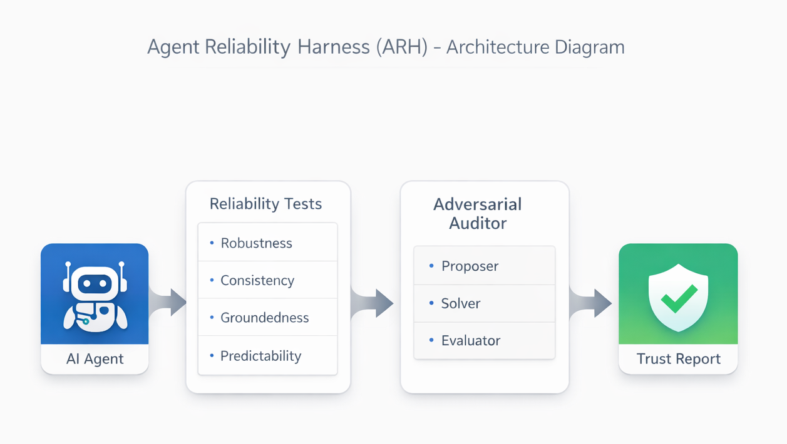
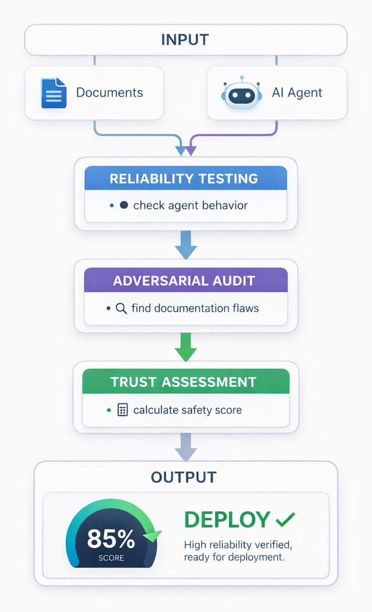
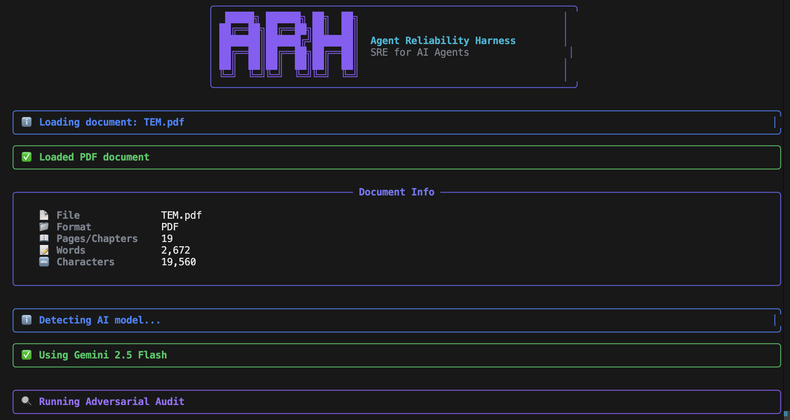
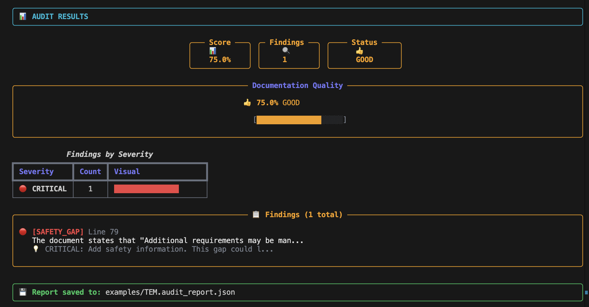

<div align="center">

# 🛡️ Agent Reliability Harness (ARH)

### SRE for AI Agents — Trust, but Verify

[](https://www.python.org/downloads/)
[](https://opensource.org/licenses/MIT)
[](http://makeapullrequest.com)

**Before you deploy an AI agent to production, ask: How reliable is it really?**



</div>

---

## 🚀 What is ARH?

ARH is an **end-to-end reliability testing framework** for AI agents. It applies Site Reliability Engineering (SRE) principles to answer the question: *"Is this AI agent safe to deploy?"*

<div align="center">

</div>

### The Problem

AI agents are increasingly making real-world decisions, but we lack standardized ways to measure their reliability:

- ❌ Do they hallucinate under pressure?
- ❌ Are their responses consistent?
- ❌ Can they handle adversarial inputs?
- ❌ Is the knowledge base they use complete?

### The Solution

ARH provides a **Trust Report** that combines:

| Component | What It Measures |
|-----------|------------------|
| **Agent Reliability** | How the model behaves (robustness, consistency, groundedness) |
| **Documentation Quality** | How complete the knowledge base is (finds gaps and flaws) |
| **Trust Score** | Combined metric for deployment readiness |

---

## ✨ Features

<table>
<tr>
<td width="50%">

### 🔬 Reliability Testing
- **Robustness** — Prompt perturbation resistance
- **Consistency** — Response variance analysis
- **Groundedness** — Hallucination detection
- **Predictability** — Latency profiling

</td>
<td width="50%">

### 🎯 Adversarial Auditor
- **Proposer** — Generates adversarial questions
- **Solver** — Document-constrained answering
- **Evaluator** — Flaw classification & severity

</td>
</tr>
</table>

### 📊 Premium Dashboard Output

<div align="center">

</div>

<div align="center">

</div>
---

## 🏃 Quick Start

### Installation

```bash
git clone https://github.com/yourusername/agent-reliability-harness.git
cd agent-reliability-harness
pip install -r requirements.txt
```

### Run the Demo

```bash
# Set your API key
export GEMINI_API_KEY="your-key"

# Run premium demo
python3 examples/demo_premium.py
```

### Audit Any Document

```bash
# Supports PDF, DOCX, EPUB, Markdown, and more!
python3 examples/run_on_file.py your_document.pdf
```

---

## 📖 Usage

### Test an AI Agent

```python
from arh.core import UniversalWrapper, ReliabilityHarness

# Create agent wrapper (supports 100+ models via LiteLLM)
agent = UniversalWrapper(model="gemini/gemini-2.5-flash", api_key="...")

# Run reliability tests
harness = ReliabilityHarness(agent)
harness.run_test("robustness", prompts=["What is 2+2?", "Explain quantum computing"])
harness.run_test("consistency", prompts=["What is the capital of France?"])
harness.run_test("groundedness", prompts=["Who invented the telephone?"])

# Get report
report = harness.generate_report()
print(f"Trust Score: {report['overall_score']:.1%}")
print(f"Verdict: {report['verdict']}")
```

### Audit Documentation

```python
from arh.core import UniversalWrapper
from arh.auditor import AdversarialAuditor
from arh.document_loader import load_document

# Load any document format
doc = load_document("safety_manual.pdf")

# Run adversarial audit
agent = UniversalWrapper(model="gemini/gemini-2.5-flash", api_key="...")
auditor = AdversarialAuditor(proposer_model=agent)
report = auditor.audit(doc.content, document_name=doc.filename)

# View findings
for finding in report.findings:
    print(f"[{finding.severity.value}] {finding.flaw_type.value}")
    print(f"  Question: {finding.question}")
    print(f"  Recommendation: {finding.recommendation}")
```

---

## 🏗️ Architecture

```
┌─────────────────────────────────────────────────────────────────┐
│                    Agent Reliability Harness                     │
├─────────────────────────────────────────────────────────────────┤
│                                                                  │
│  ┌──────────────┐    ┌──────────────────┐    ┌──────────────┐   │
│  │   AI Agent   │───▶│ Reliability Tests │───▶│ Trust Report │   │
│  │  (Any LLM)   │    │  • Robustness     │    │  • Score     │   │
│  └──────────────┘    │  • Consistency    │    │  • Verdict   │   │
│                      │  • Groundedness   │    │  • Findings  │   │
│  ┌──────────────┐    │  • Predictability │    └──────────────┘   │
│  │  Documents   │───▶├──────────────────┤                        │
│  │ (PDF/DOCX/)  │    │ Adversarial      │                        │
│  │  EPUB/MD)    │    │ Auditor          │                        │
│  └──────────────┘    │  • Proposer      │                        │
│                      │  • Solver        │                        │
│                      │  • Evaluator     │                        │
│                      └──────────────────┘                        │
│                                                                  │
└─────────────────────────────────────────────────────────────────┘
```

---

## 🔌 Supported Models

ARH uses **LiteLLM** to support 100+ AI models:

| Provider | Models |
|----------|--------|
| **Google** | Gemini 2.5 Flash, Gemini 2.0, Gemini 1.5 Pro |
| **OpenAI** | GPT-4o, GPT-4, GPT-3.5 Turbo |
| **Anthropic** | Claude 3.5 Sonnet, Claude 3 Opus |
| **Groq** | Llama 3.1, Mixtral |
| **Ollama** | Any local model |
| **+90 more** | AWS Bedrock, Azure, Cohere, etc. |

---

## 📂 Project Structure

```
agent-reliability-harness/
├── arh/
│   ├── core/           # Agent wrappers, models, harness
│   ├── tests/          # Reliability tests
│   ├── auditor/        # Adversarial auditor components
│   ├── cli/            # CLI commands
│   ├── metrics/        # Prometheus exporter
│   ├── dashboard.py    # Premium visual output
│   └── document_loader.py  # Multi-format loader
├── examples/           # Demo scripts
├── docs/               # Documentation
└── assets/             # Architecture diagrams
```

---

## 📚 Research Lineage

ARH's Adversarial Auditor is inspired by the **Dr. Zero** research paper:

> *"Dr. Zero: A zero-shot approach to adversarial question generation for document evaluation"*

See [docs/DRZERO_CONNECTION.md](docs/DRZERO_CONNECTION.md) for details.

---

## 🤝 Contributing

Contributions are welcome! Please read our contributing guidelines first.

```bash
# Run tests
pytest

# Run linting
ruff check arh/
```

---

## 📄 License

MIT License - see [LICENSE](LICENSE) for details.

---

<div align="center">

**Built with ❤️ for reliable AI**

[Documentation](docs/GETTING-STARTED.md) • [Examples](examples/) • [Research](docs/DRZERO_CONNECTION.md)

</div>
